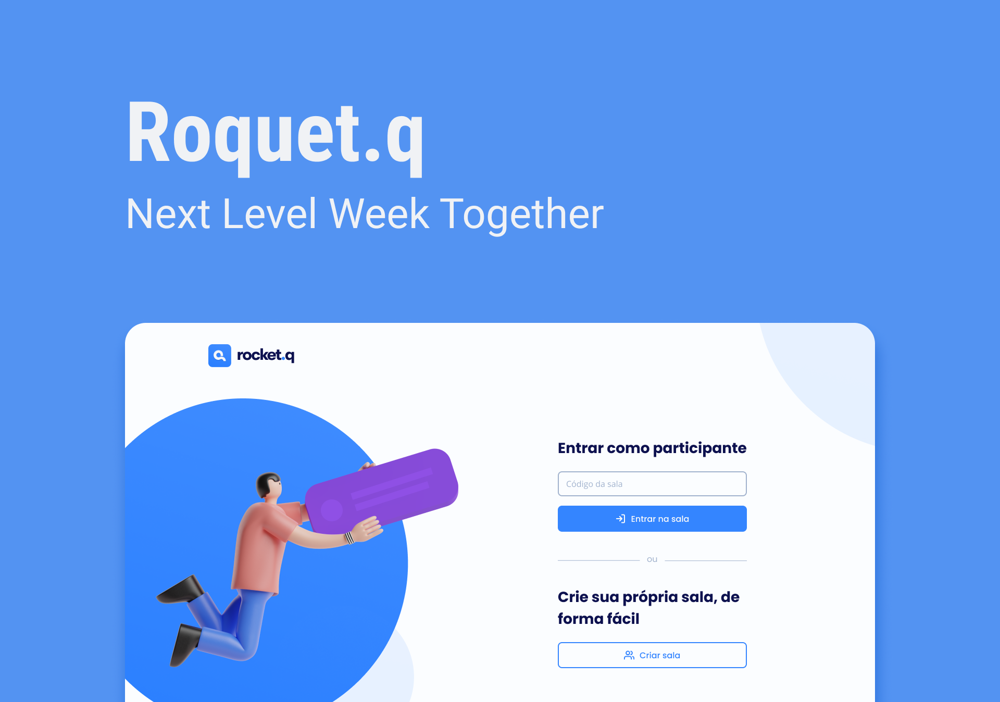

<h1 align="center">
    Rocket.q
</h1>

Tecnologias usadas:

- HTML
- CSS

## 💻 Project

Rocket.Q é uma plataforma de questões em salas privadas que utiliza senhas para entrar, O administrador da sua respectiva sala lê as questões e as responde. Rocket.Q pode ser usado por streamers, ou até mesmo em eventos para facilitar a conexão com o público.

## 👨‍🎓 Objetico 

O objetivo pessoal para com o projeto é o entedimento e a estrturação de processos em CSS, por esse motivo, o desenho da iniciativa diferencia um pouco do apresentado pela rocketseat

## 🔖 Layout

você pode acessar o layout do figma [this link](https://www.figma.com/community/file/1009821158959690135). <strong> É necessário criar uma conta </strong> [Figma](https://figma.com) para acessar.

---

Made with ♥ by Rocketseat :wave: [Join our community!](https://discordapp.com/invite/gCRAFhc)
